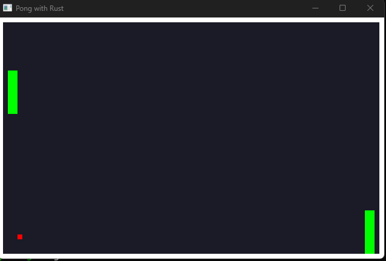

# pong
A Pong implementation using RLTK, a Rust toolkit for roguelike games.

This program can also be built into WebAssembly artifacts and be linked to a webpage as it is done in saulreyna.dev/dev

The deploy.sh automates the workflow of first building the Rust project -> creates the WebAssembly files -> copies the generated files to a local Apache server folder for local testing.
